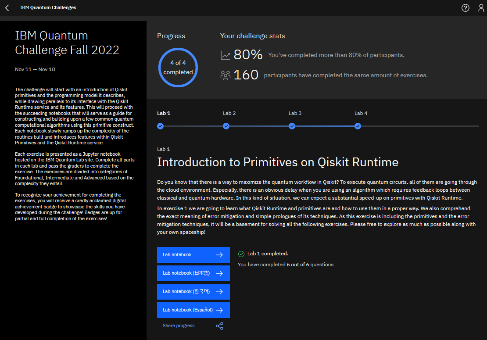

# IBM Quantum Challenge Fall 2022  
  
These are the solutions I submitted for the [IBM Quantum Challenge Fall 2022](https://challenges.quantum-computing.ibm.com/fall-2022)  
The original challenge repository is at [/qiskit-community/ibm-quantum-challenge-fall-22](https://github.com/qiskit-community/ibm-quantum-challenge-fall-22)  
  
## Challenge Details  
__Site:__ [challenges.quantum-computing.ibm.com/fall-2022](https://challenges.quantum-computing.ibm.com/fall-2022)  
__Date:__ November 2022  
  
## Certificate  
Here's a screenshot of my challenge portal dashboard.  
  
  
## Description  
The challenge consisted of 4 labs, in the form of `.ipynb` workbooks.  
I also made a `.html` copy of each workbook.  
  
## Topics  
[`lab1`](lab1.ipynb) - Qiskit Runtime  
[`lab2`](lab2.ipynb) - Machine Learning: Support Vector Machine  
[`lab3`](lab3.ipynb) - Optimisation: Travelling Salesman Problem  
[`lab4`](lab4.ipynb) - Chemistry: Ground State Energy, Dipoles  